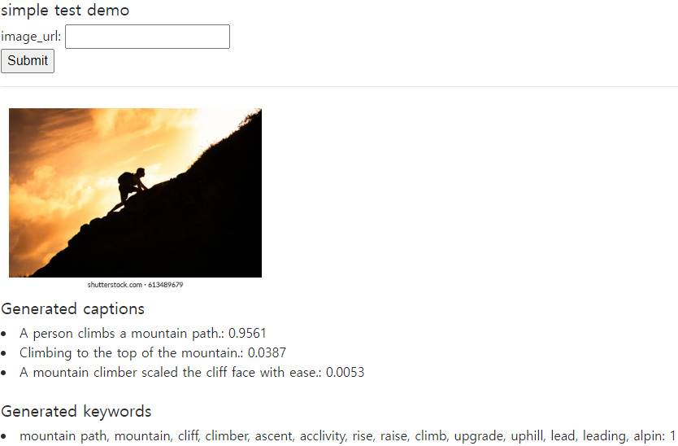
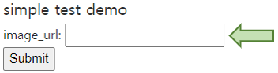
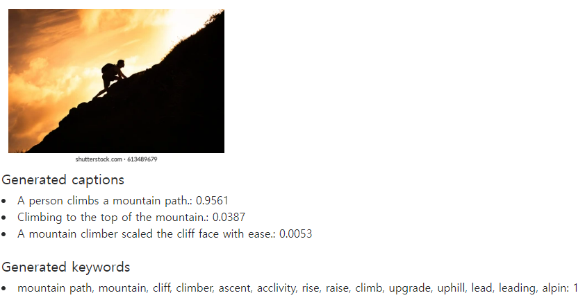
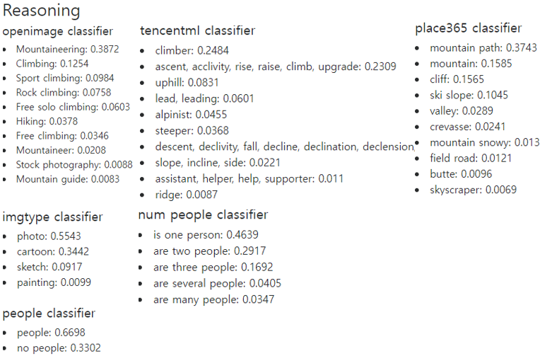

# Simple interactive web-based demo for Socratic models
[[paper]](https://arxiv.org/abs/2204.00598) [[official repository]](https://github.com/google-research/google-research/tree/master/socraticmodels) [[official project website]](https://socraticmodels.github.io/)
> **Abstract** Large pretrained (e.g., “foundation”) models exhibit distinct capabilities depending on the domain of data they are trained on. While these domains are generic, they may only barely overlap. For example, visual-language models (VLMs) are trained on Internet-scale image captions, but large language models (LMs) are further trained on Internet-scale text with no images (e.g., spreadsheets, SAT questions, code). As a result, these models store different forms of commonsense knowledge across different domains. In this work, we show that this diversity is symbiotic, and can be leveraged through Socratic Models (SMs): a modular framework in which multiple pretrained models may be composed zero-shot i.e., via multimodal-informed prompting, to exchange information with each other and capture new multimodal capabilities, without requiring finetuning. With minimal engineering, SMs are not only competitive with state-of-the-art zero-shot image captioning and video-to-text retrieval, but also enable new applications such as (i) answering free-form questions about egocentric video, (ii) engaging in multimodal assistive dialogue with people (e.g., for cooking recipes) by interfacing with external APIs and databases (e.g., web search), and (iii) robot perception and planning.



### NOTE:
+ This demo produces captions and keywords for image search, highly related to an input image.
+ This is an un-official repository for simple interactive web-based demo for socratic models.
  + I would like to share an easy-to-use demo for socratic models.
  + The authors provided demo codes but it is built in python-notebook and zeroshot classifiers should be computed in order to test it. It takes much time.
+ This repo contains precomputed zero-shot classifiers using a text encoder of CLIP ViT-L/14 model.
  + object classifier using class names from [tencent-ML-images](https://github.com/Tencent/tencent-ml-images/blob/master/data/dictionary_and_semantic_hierarchy.txt)
  + place classifier using class names from [Place365](http://places2.csail.mit.edu/)
  + additional object classifier using class names from [openimage](https://storage.googleapis.com/openimages/web/download.html)

### prompt for image captioning
```python
    prompt_caption = f'''I am an intelligent image captioning bot.
    This image is a {img_type}. There {ppl_result}.
    I think this photo was taken at a {sorted_places[0]}, {sorted_places[1]}, or {sorted_places[2]}.
    I think there might be a {object_list} in this {img_type}.
    A creative short caption I can generate to describe this image is:'''
```

### prompt for keyword generation
```python
    prompt_search = f'''Let's list keywords that include the following description.
    This image is a {img_type}. There {ppl_result}.
    I think this photo was taken at a {sorted_places[0]}, {sorted_places[1]}, or {sorted_places[2]}.
    I think there might be a {object_list} in this {img_type}.
    Relevant keywords which we can list and are seperated with comma are:'''
```

## Overview
### Get your OpenAI API Key for GPT3
+ Don't worry about it. It's free.
+ See [https://beta.openai.com/account/api-keys](https://beta.openai.com/account/api-keys)

### How to run the demo
```
$ python demo_socratic.py --port 5000 --openai-API-key {YOUR_OpenAI_API_KEY}
```
+ Demo will be [http://0.0.0.0:5000/](http://0.0.0.0:5000/)

### How to use the demo
+ Just fetch an image url.



### Result
+ url: https://image.shutterstock.com/image-photo/man-climbing-mountain-260nw-613489679.jpg
+ generated caption and keywords


